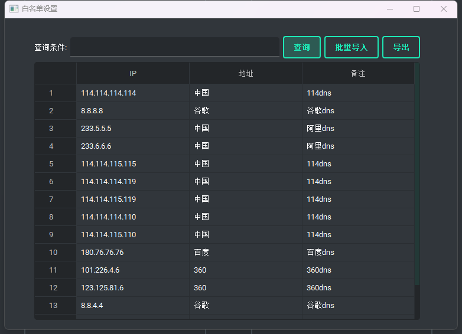
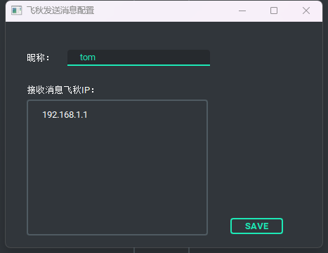
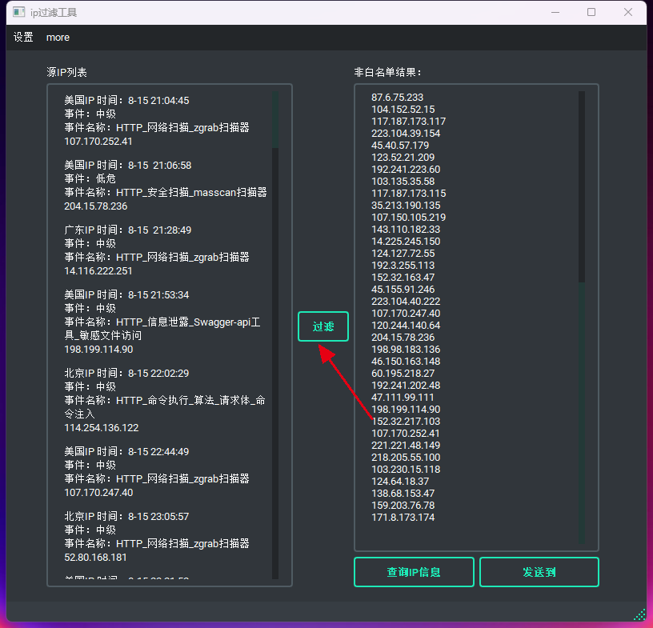
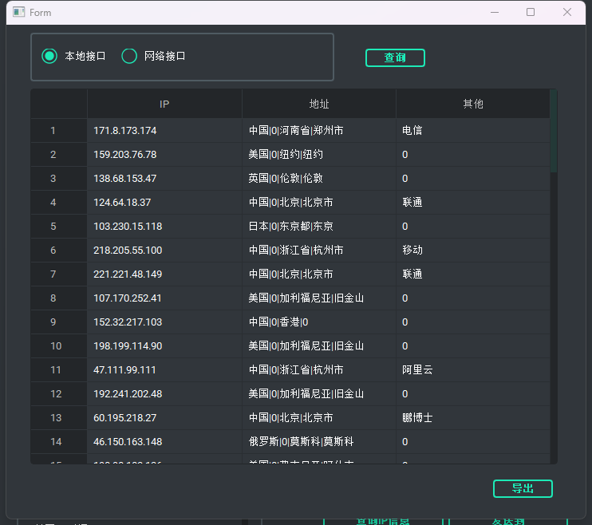
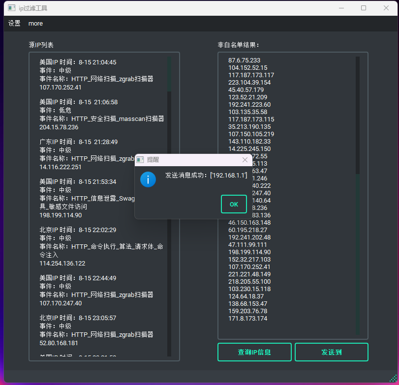

# filtration-IP
# 工具介绍
- 该工具用于HW期间对大量ip进行快速筛选，剔除白名单地址，防止误封
- 添加ip归属地查询功能
- 添加将过滤结果一键发送至飞秋

# 使用方法
双击“ip过滤工具.exe”启动程序，首次使用会创建ip白名单数据库，启动会比较耗时
## 白名单设置
点击"设置"-->"白名单设置"，可打开白名单设置界面  
- 可使用右键对白名单进行添加和删除
- 支持全字段模糊搜索
- 支持一键导出白名单数据
- 支持从excel批量导入白名单数据  

## 扩展设置
点击"扩展"-->"飞秋设置"，可打开飞秋设置界面
- 可设置飞秋发送消息昵称
- 可设置飞秋发送消息的目标ip

## ip过滤 
在界面的"源ip列表" 输入待过滤的ip列表，点击"过滤"按钮，将会在非白名单中展示过滤后的结果

## ip信息查询
点击查询ip信息按钮，选择本地/联网 ，点击查询按钮，即可自动查询过滤后ip的归属地信息
      
- 归属地结果信息支持一键导出

## 一键发送飞秋
点击"发送"按钮，将会根据设置好的昵称和目标ip，发送过滤后的ip信息

    
